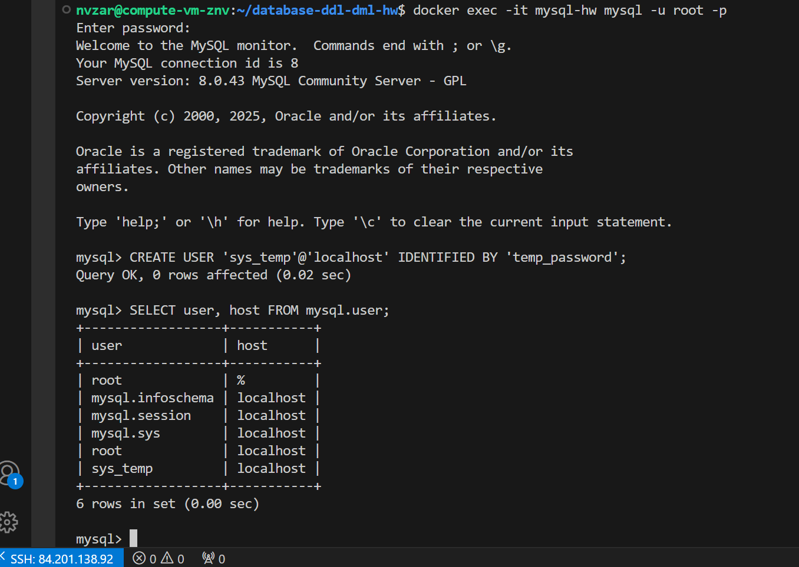
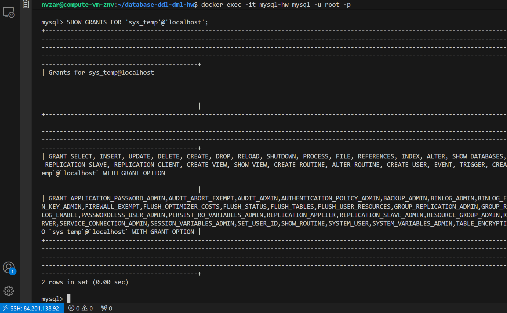
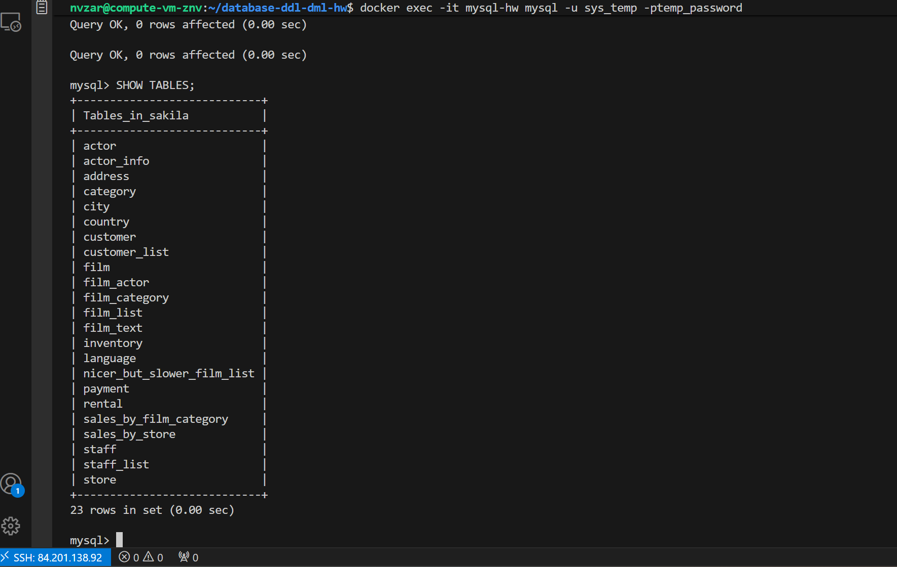
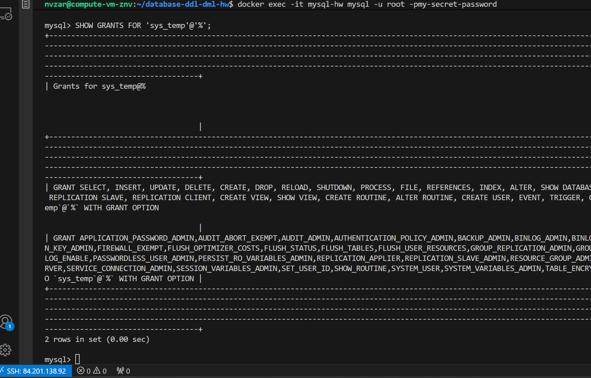

 Домашнее задание к занятию «Работа с данными (DDL/DML)»

**Студент:** Зарубов Николай 

   ```
## Задание 1

### 1.1. Поднятие MySQL 8.0+ в Docker

```bash
# Создание Docker контейнера с MySQL 8.0
docker run --name mysql-hw \
  -p 3306:3306 \
  -e MYSQL_ROOT_PASSWORD=my-secret-password \
  -d mysql:8.0

# Проверка статуса контейнера
docker ps -a
```

### 1.2. Создание учётной записи sys_temp

```bash
# Подключение к MySQL
docker exec -it mysql-hw mysql -u root -pmy-secret-password
```

```sql
-- Создание пользователя sys_temp
CREATE USER 'sys_temp'@'localhost' IDENTIFIED BY 'temp_password';
```

### 1.3. Получение списка пользователей в базе данных

```sql
-- Запрос для получения списка пользователей
SELECT user, host FROM mysql.user;
```



### 1.4. Предоставление всех прав пользователю sys_temp

```sql
-- Предоставление всех привилегий пользователю sys_temp
GRANT ALL PRIVILEGES ON *.* TO 'sys_temp'@'localhost' WITH GRANT OPTION;

-- Применение изменений
FLUSH PRIVILEGES;
```

### 1.5. Получение списка прав для пользователя sys_temp

```sql
-- Запрос для просмотра прав пользователя sys_temp
SHOW GRANTS FOR 'sys_temp'@'localhost';
```



### 1.6. Смена типа аутентификации для sys_temp

```sql
-- Смена аутентификации на mysql_native_password
ALTER USER 'sys_temp'@'localhost' IDENTIFIED WITH mysql_native_password BY 'temp_password';

-- Создание дублирующего пользователя для всех хостов (для решения проблем с подключением)
CREATE USER 'sys_temp'@'%' IDENTIFIED WITH mysql_native_password BY 'temp_password';
GRANT ALL PRIVILEGES ON *.* TO 'sys_temp'@'%' WITH GRANT OPTION;
FLUSH PRIVILEGES;

-- Переподключение к базе данных от имени sys_temp
exit
docker exec -it mysql-hw mysql -u sys_temp -ptemp_password
```

### 1.7. Скачивание и восстановление дампа базы данных Sakila

```bash
# Скачивание дампа Sakila
wget https://downloads.mysql.com/docs/sakila-db.zip

# Распаковка архива с помощью Python
python3 -c "
import zipfile
with zipfile.ZipFile('sakila-db.zip', 'r') as zip_ref:
    zip_ref.extractall('.')
"

# Копирование файлов в контейнер MySQL
docker cp sakila-db/sakila-schema.sql mysql-hw:/tmp/
docker cp sakila-db/sakila-data.sql mysql-hw:/tmp/
```

```sql
-- Восстановление дампа в базу данных
CREATE DATABASE IF NOT EXISTS sakila;
USE sakila;
SOURCE /tmp/sakila-schema.sql;
SOURCE /tmp/sakila-data.sql;
```

### 1.8. Получение всех таблиц базы данных

```sql
-- Переключение на базу данных sakila
USE sakila;

-- Получение списка всех таблиц
SHOW TABLES;
```



### запросы Задания 1

```sql
-- Создание пользователя
CREATE USER 'sys_temp'@'localhost' IDENTIFIED BY 'temp_password';

-- Просмотр пользователей
SELECT user, host FROM mysql.user;

-- Предоставление прав
GRANT ALL PRIVILEGES ON *.* TO 'sys_temp'@'localhost' WITH GRANT OPTION;
FLUSH PRIVILEGES;

-- Просмотр прав пользователя
SHOW GRANTS FOR 'sys_temp'@'localhost';

-- Смена аутентификации
ALTER USER 'sys_temp'@'localhost' IDENTIFIED WITH mysql_native_password BY 'temp_password';

-- Создание дублирующего пользователя
CREATE USER 'sys_temp'@'%' IDENTIFIED WITH mysql_native_password BY 'temp_password';
GRANT ALL PRIVILEGES ON *.* TO 'sys_temp'@'%' WITH GRANT OPTION;
FLUSH PRIVILEGES;

-- Восстановление базы данных
CREATE DATABASE IF NOT EXISTS sakila;
USE sakila;
SOURCE /tmp/sakila-schema.sql;
SOURCE /tmp/sakila-data.sql;

-- Просмотр таблиц
SHOW TABLES;
```

## Задание 2

Таблица с названиями таблиц и их первичными ключами базы данных Sakila:

| Название таблицы | Название первичного ключа |
|------------------|---------------------------|
| actor            | actor_id                  |
| address          | address_id                |
| category         | category_id               |
| city             | city_id                   |
| country          | country_id                |
| customer         | customer_id               |
| film             | film_id                   |
| film_actor       | actor_id, film_id         |
| film_category    | film_id, category_id      |
| film_text        | film_id                   |
| inventory        | inventory_id              |
| language         | language_id               |
| payment          | payment_id                |
| rental           | rental_id                 |
| staff            | staff_id                  |
| store            | store_id                  |

### SQL запрос для получения первичных ключей

```sql
-- Запрос для получения информации о первичных ключах всех таблиц
SELECT 
    table_name AS 'Название таблицы',
    GROUP_CONCAT(column_name ORDER BY ordinal_position) AS 'Название первичного ключа'
FROM 
    information_schema.key_column_usage
WHERE 
    table_schema = 'sakila' 
    AND constraint_name = 'PRIMARY'
GROUP BY 
    table_name
ORDER BY 
    table_name;
```

## Задание 3* (Дополнительное)

### 3.1. Удаление прав у пользователя sys_temp

```bash
# Подключитесь как root
docker exec -it mysql-hw mysql -u root -pmy-secret-password
```

```sql
-- Удаление прав на внесение, изменение и удаление данных
REVOKE INSERT, UPDATE, DELETE ON sakila.* FROM 'sys_temp'@'localhost';
REVOKE INSERT, UPDATE, DELETE ON sakila.* FROM 'sys_temp'@'%';

-- Применение изменений
FLUSH PRIVILEGES;
```

### 3.2. Проверка прав пользователя sys_temp

```sql
-- Просмотр оставшихся прав пользователя
SHOW GRANTS FOR 'sys_temp'@'localhost';
SHOW GRANTS FOR 'sys_temp'@'%';
```



### Простыня со всеми запросами Задания 3*

```sql
-- Удаление прав на модификацию данных
REVOKE INSERT, UPDATE, DELETE ON sakila.* FROM 'sys_temp'@'localhost';
REVOKE INSERT, UPDATE, DELETE ON sakila.* FROM 'sys_temp'@'%';

-- Применение изменений
FLUSH PRIVILEGES;

-- Проверка прав
SHOW GRANTS FOR 'sys_temp'@'localhost';
SHOW GRANTS FOR 'sys_temp'@'%';
```

## Полезные команды Docker

```bash
# Запуск контейнера
docker start mysql-hw

# Остановка контейнера
docker stop mysql-hw

# Удаление контейнера
docker rm mysql-hw

# Подключение к контейнеру
docker exec -it mysql-hw mysql -u root -pmy-secret-password
```

## Проверка результатов

### Проверка данных в базе Sakila

```sql
-- Проверка количества записей
SELECT COUNT(*) AS actor_count FROM actor;     -- Результат: 200
SELECT COUNT(*) AS film_count FROM film;       -- Результат: 1000  
SELECT COUNT(*) AS customer_count FROM customer; -- Результат: 599

-- Просмотр первых записей
SELECT * FROM actor LIMIT 5;
```
